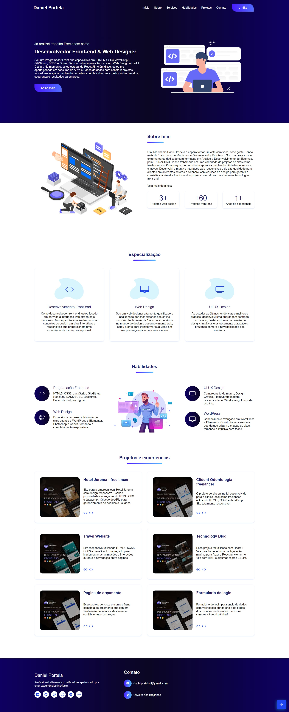

<b>Portfólio - Front-end Developer</b>

&nbsp;
&nbsp;
&nbsp;

Explore meu portfólio e mergulhe em um mundo de design inovador, projetos cativantes e soluções visualmente impactantes. Esse projeto foi pensado e detalhado em cada linha de código, visando sempre a qualidade de navegação.

<a href="https://danielportela.netlify.app/"><strong>Demonstração ao vivo</strong></a>

 

<b>HTML Semântico:</b>

Utilização de elementos HTML semânticos para estruturar o conteúdo de forma clara e compreensível.  

<b>CSS Bem Estruturado:</b>

Organização do CSS usando boas práticas, como a metodologia BEM (Block Element Modifier) para facilitar a manutenção.  

<b>JavaScript Interativo:</b>

Implementação de interatividade usando JavaScript para aprimorar a experiência do usuário sem sacrificar o desempenho.  

<b>Responsividade Total:</b>

Adaptação perfeita do layout para diversos tamanhos de tela, garantindo uma experiência consistente em dispositivos desktop, tablets e smartphones.  

<b>Design Atraente e Consistente:</b>

Escolha cuidadosa de paleta de cores e tipografia para criar um design visualmente agradável e profissional.
Consistência visual em todo o site para uma experiência coesa.  

<b>Usabilidade e Navegabilidade:</b>

Menu de navegação intuitivo e fácil de usar em todas as plataformas.
Garantia de que os elementos interativos sejam acessíveis e compreensíveis para todos os usuários.  

<b>Performance Otimizada:</b>

Carregamento eficiente de recursos para garantir tempos de carregamento rápidos.
Otimização de imagens e código para reduzir a largura de banda necessária.  

<b>Acessibilidade:</b>

Implementação de práticas de acessibilidade para garantir que o site seja utilizado por todos, independentemente de limitações físicas ou tecnológicas.  

<b>Validação de Código:</b>

Garantia de que o HTML, CSS e JavaScript sigam padrões e estejam livres de erros, utilizando validadores adequados.  

<b>Compatibilidade Cross-Browser:</b>

Testes em diferentes navegadores para assegurar uma experiência consistente para usuários de Chrome, Firefox, Safari, Edge, entre outros.  

<b>Adaptação Dinâmica:</b>

Utilização de recursos dinâmicos, como animações suaves e transições, para melhorar a experiência do usuário sem prejudicar a usabilidade.  

<b>Feedback Visual:</b>

Implementação de feedback visual para ações do usuário, como hover, foco e clique, para melhorar a interatividade.  

<b>Manutenibilidade do Código:</b>

Compromisso com a melhoria contínua do projeto, incluindo atualizações regulares de conteúdo e refinamento do design conforme necessário.

 <b>Contato:</b>

Se você quiser entrar em contato comigo, sinta-se a vontade.
 

 
 

